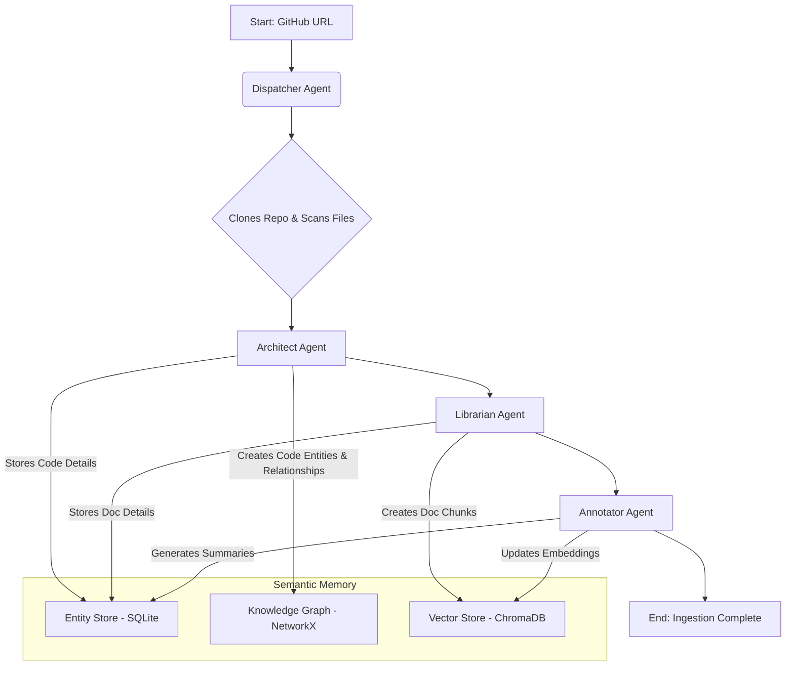
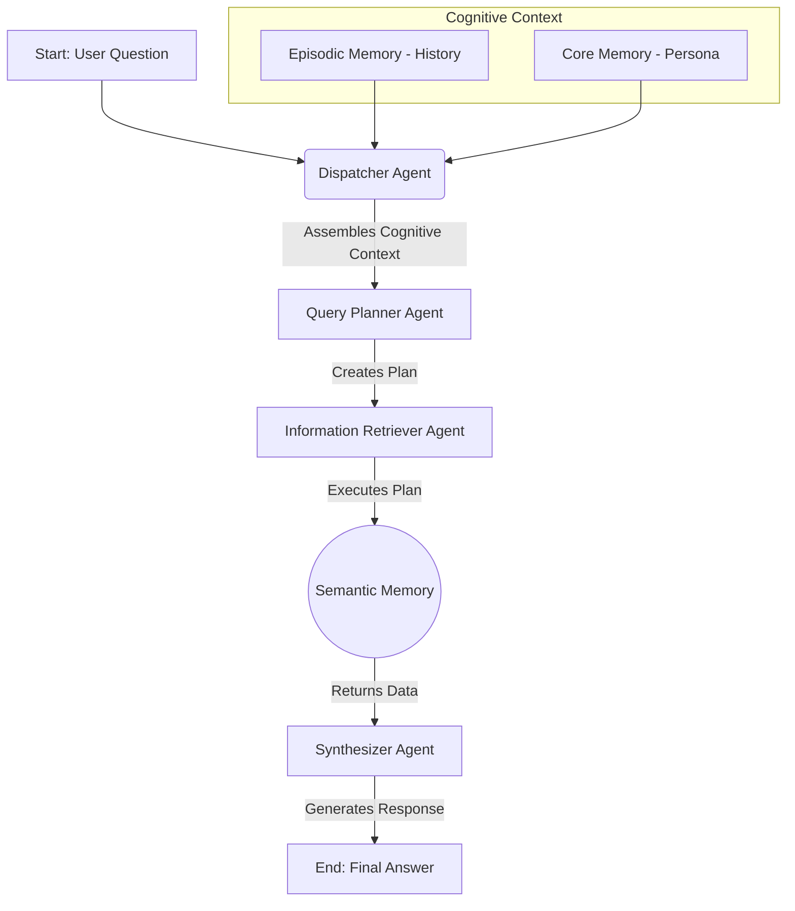

# 🏗️ RepoRover System Architecture

RepoRover is an AI-powered code analysis platform that provides deep insights into GitHub repositories. The system is built on a modern, scalable architecture that combines FastAPI for the backend, AI models for code understanding, and a clean, responsive frontend.

## 🌟 Core Principles

- **Modular Design**: Components are loosely coupled and follow the single responsibility principle
- **Extensible**: Easy to add new analysis modules or integrate with different AI models
- **Real-time Processing**: Provides immediate feedback during repository analysis
- **Scalable**: Designed to handle repositories of various sizes efficiently

## 🧩 Core Components

### 1. Backend Services
- **FastAPI Application**: Handles HTTP requests and serves the frontend
- **Background Task Queue**: Manages long-running repository analysis tasks
- **API Endpoints**: 
  - `/ingest`: Start repository ingestion
  - `/ingest/status/{task_id}`: Check ingestion status
  - `/query`: Submit questions about the repository

### 2. AI Components
- **Dispatcher Agent**: Orchestrates the analysis workflow
- **Semantic Memory Manager**: Handles storage and retrieval of code knowledge
- **AI Model Integrations**: Support for multiple AI providers (Gemini, Groq)

### 3. Frontend
- **Single Page Application**: Built with vanilla JavaScript
- **Responsive UI**: Using Tailwind CSS for styling
- **Real-time Updates**: WebSocket-based updates for long-running tasks

### 4. Data Storage
- **Semantic Memory**: Stores processed code information
- **Vector Database**: For efficient similarity search of code patterns
- **Task Status Tracking**: In-memory storage for monitoring analysis progress

## 🔄 Ingestion Workflow

The ingestion process transforms a GitHub repository into a structured knowledge base that can be queried naturally.

### Trigger
- User submits a GitHub repository URL through the web interface

### Process Flow
1. **Repository Cloning**
   - Clones the target repository locally
   - Scans the repository structure
   - Identifies different file types and their relationships

2. **Code Analysis**
   - Parses source code files
   - Extracts functions, classes, and their documentation
   - Builds a semantic understanding of the codebase
   - Identifies dependencies between components

3. **Knowledge Base Population**
   - Stores extracted information in the semantic memory
   - Generates vector embeddings for semantic search
   - Builds a knowledge graph of the codebase



## 💬 Query Processing Workflow

### Trigger
- User submits a natural language question about the codebase

### Process Flow
1. **Query Understanding**
   - Analyzes the user's question
   - Identifies key concepts and intents
   - Determines relevant parts of the codebase to examine

2. **Context Retrieval**
   - Searches the semantic memory for relevant code snippets
   - Retrieves related documentation and examples
   - Gathers contextual information about the code

3. **Response Generation**
   - Formulates a comprehensive answer using AI
   - Includes relevant code examples
   - Provides additional context and suggestions

## 🚀 Deployment Architecture

```
┌─────────────────┐     ┌─────────────────────┐     ┌──────────────────┐
│                 │     │                     │     │                  │
│  User's Browser ├────►│  FastAPI Backend    │◄───►│  AI Models       │
│                 │     │  (Python)           │     │  (Gemini, Groq)  │
└─────────────────┘     └─────────┬───────────┘     └──────────────────┘
                                  │
                                  ▼
                         ┌───────────────────┐
                         │                   │
                         │  Semantic Memory  │
                         │  (ChromaDB)       │
                         │                   │
                         └───────────────────┘
```

## 🔄 Data Flow

1. **Ingestion Path**
   - GitHub Repo → FastAPI → Background Task → AI Processing → Semantic Memory

2. **Query Path**
   - User Question → FastAPI → AI Model → Semantic Memory → Response Generation → User

