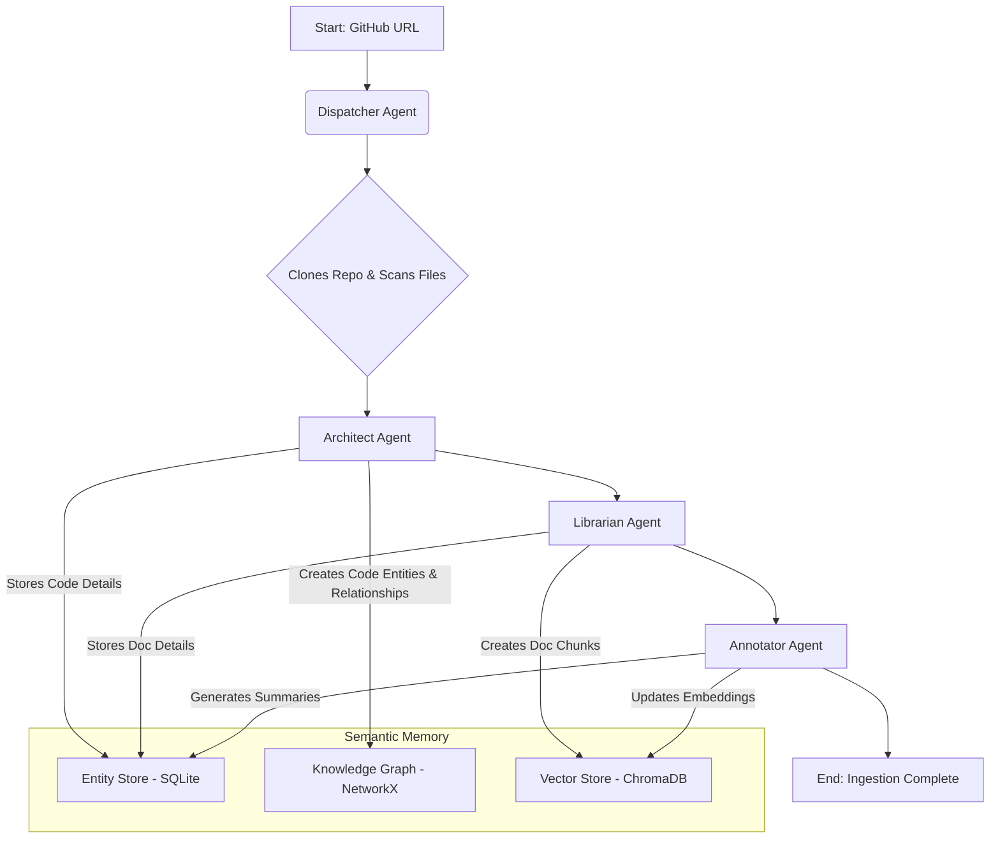
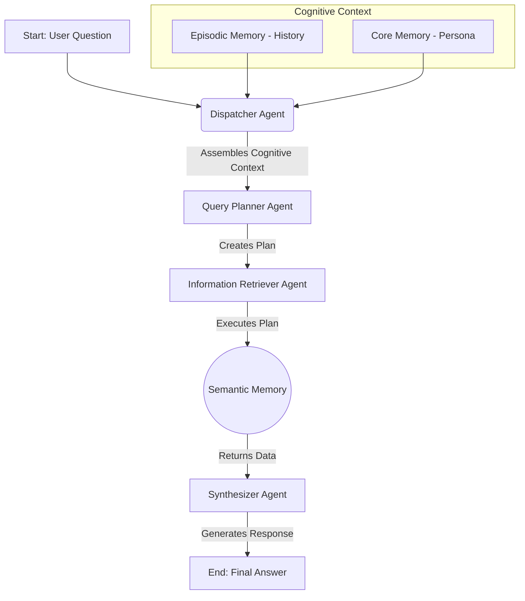

# RepoRover System Architecture

RepoRover is a multi-agent system designed to build a deep, contextual understanding of software repositories. The architecture is centered around a **Dispatcher Agent** that orchestrates two primary, workflow-driven processes: **Ingestion** and **Querying**.

---

## Core Components

-   **Agents**: Specialized modules responsible for specific tasks like parsing code, generating summaries, or planning queries.
-   **Memory**: A collection of distinct memory systems that provide agents with both long-term knowledge and short-term conversational context.
-   **Workflows**: JSON-defined procedures that orchestrate the sequence of agent actions for a given high-level task.

---

## 1. The Ingestion Workflow

The goal of the ingestion workflow is to deconstruct a source code repository and build a comprehensive, multi-layered knowledge base within the **Semantic Memory**.

**Trigger**: A user provides a GitHub repository URL.

## 2. The Query Workflow

The query workflow leverages the populated memory stores and conversational history to answer a user's question about the codebase.

**Trigger**: A user provides a question about the codebase.

